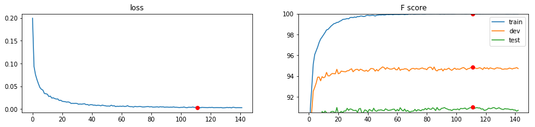

# NER_pytorch

Named Entity Recognition on CoNLL dataset using BiLSTM+CRF implemented with Pytorch

paper
- Neural Architectures for Named Entity Recognition

- End-toEnd Sequence labeling via BLSTM-CNN-CRF
        
code
- https://github.com/ZhixiuYe/NER-pytorch

This code is customized so that i use latest Pytorch version(1.1.0) starting with https://github.com/ZhixiuYe/NER-pytorch

To use jupyter notebook to visualize the result, i transform ~.py into .ipynb

The f1 score performane of test CoNLL data is 91.3%

## Conll performance

   f1 91.3%

## 0. prepare data
To get pre-trained word embedding vector Glove

   run prepare_data.ipynb
   
## 1. train
150 epoch is enough, 24h with oneP100 GPU, 51 epoch has best f1 score, i use visdom
### model shape
1) word embedding with Glove(100d) + charactor embedding with CNN(25d)
2) BiLSTM 1 layer + Highway
3) Linear 400d -> 19d with tanh

        BiLSTM_CRF(
                  (char_embeds): Embedding(85, 25)
                  (char_cnn3): Conv2d(1, 25, kernel_size=(3, 25), stride=(1, 1), padding=(2, 0))
                  (word_embeds): Embedding(400176, 100)
                  (dropout): Dropout(p=0.5)
                  (lstm): LSTM(125, 200, bidirectional=True)
                  (hw_trans): Linear(in_features=25, out_features=25, bias=True)
                  (hw_gate): Linear(in_features=25, out_features=25, bias=True)
                  (h2_h1): Linear(in_features=400, out_features=200, bias=True)
                  (tanh): Tanh()
                  (hidden2tag): Linear(in_features=400, out_features=19, bias=True)
        )

   run 1. train.ipynb

## 2. evaluation
   run 2. evaluation.ipynb
 
## Result

## data
https://www.clips.uantwerpen.be/conll2003/ner/

The CoNLL-2003 shared task data files contain four columns separated by a single space. Each word has been put on a separate line and there is an empty line after each sentence. The first item on each line is a word, the second a part-of-speech (POS) tag, the third a syntactic chunk tag and the fourth the named entity tag. The chunk tags and the named entity tags have the format I-TYPE which means that the word is inside a phrase of type TYPE. Only if two phrases of the same type immediately follow each other, the first word of the second phrase will have tag B-TYPE to show that it starts a new phrase. A word with tag O is not part of a phrase. Here is an example:

        word     | POS | Syntatic chunk tag | named entity tag
        U.N.       NNP   I-NP                 I-ORG 
        official   NN    I-NP                 O 
        Ekeus      NNP   I-NP                 I-PER 
        heads      VBZ   I-VP                 O 
        for        IN    I-PP                 O 
        Baghdad    NNP   I-NP                 I-LOC 
        .          .     O                    O 

