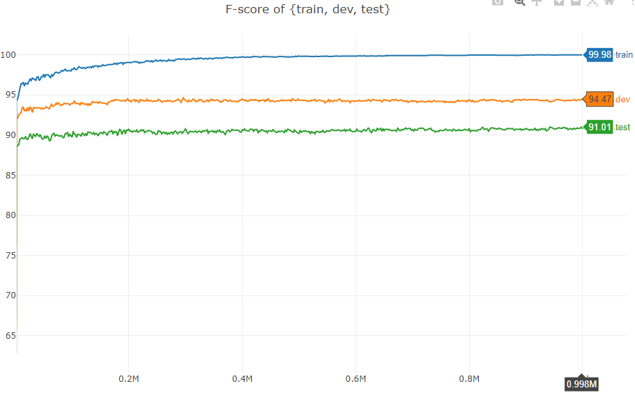

# NER-BiLSTM-CRF-PyTorch
PyTorch implementation of a BiLSTM-CRF model for named entity recognition.

## Requirements
- Python 3
- PyTorch 1.x

## Papers
- Bidirectional LSTM-CRF Models for Sequence Tagging (Huang et. al., 2015)
  - 首次将BiLSTM-CRF用于序列标注
- Neural Architectures for Named Entity Recognition (Lample et. al., 2016)
  - 最大特点是在pre-trained word embedding（skip-n-gram）的基础上结合了character-based word embeddings，通过引入字符级特征提高了模型在NER任务中的表现
    - 90.94 in CoNLL 2003 (English)
    - 91.47 in CoNLL++
- End-to-end Sequence Labeling via Bi-directional LSTM-CNNs-CRF (Ma et al., 2016)
    - CNNs

## Dataset
- CoNLL 2003 (English)
  - IOB tagging scheme (convert to IOBES)

## Model
- Embeddings
    - 100d pre-trained word embedding with Glove
    - 25d charactor embedding trained by CNNs (Ma et al., 2016)
- BiLSTM-CRF (Lample et. al., 2016)

## Results
用 Tesla T4 训练一晚，约70个 epoch，test 集上 F1 达到 90.01

## Future Works
- 后续 paper：
  - BiLSTM-CRF+ELMo ((Peters et al., 2018)
  - LM-LSTM-CRF (Liu et al., 2018)
  - Flair
  - ...
- 中文 NER

## References
- https://pytorch.org/tutorials/beginner/nlp/advanced_tutorial.html
- https://github.com/ZhixiuYe/NER-pytorch